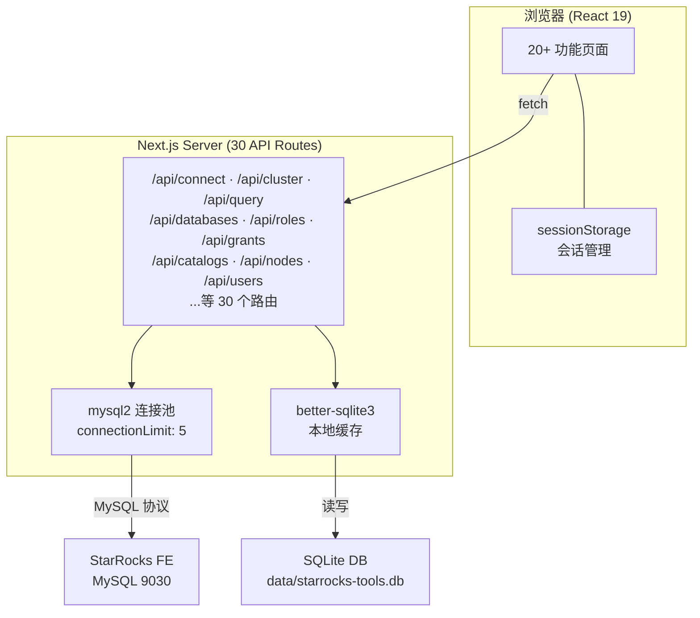
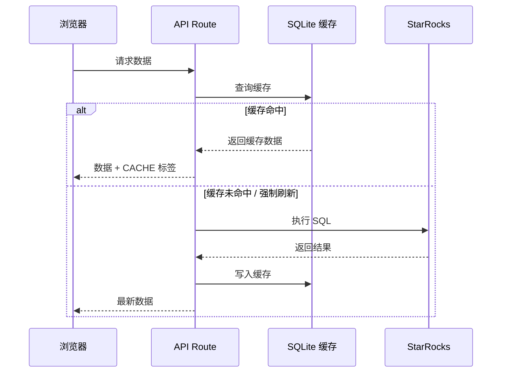

# StarRocks Manager — 系统架构与功能介绍

> 内部分享 · 2026-03-23

---

## 一、系统概述

**StarRocks Manager** 是一款专为 StarRocks 分布式数据库设计的全栈 Web 管理工具，覆盖集群监控、元数据浏览、SQL 查询、RBAC 权限管理、数据导入管理等全链路运维需求。

### 核心价值

| 价值 | 说明 |
|------|------|
| **一站式管理** | 20+ 功能页面，覆盖 DBA 日常运维全场景 |
| **安全可控** | 完整 RBAC 权限体系，三级角色（viewer/editor/admin）访问控制 |
| **高效运维** | 实时集群监控、查询终止、智能缓存、操作日志审计 |
| **多集群管理** | 支持保存多个 StarRocks 实例连接，一键切换 |
| **存算分离/一体** | 同时适配两种 StarRocks 部署架构 |

---

## 二、技术架构

### 2.1 技术栈

| 层级 | 技术 | 用途 |
|------|------|------|
| **框架** | Next.js 16 (App Router) | 全栈框架，前端 + 30 个 API Routes |
| **前端** | React 19 + TypeScript 5 | 组件化 UI |
| **StarRocks 连接** | mysql2/promise | MySQL 协议直连 StarRocks FE (9030) |
| **本地存储** | better-sqlite3 | 连接配置 + 元数据缓存（13 张缓存表） |
| **图表** | Recharts 3.8 | 数据可视化 |
| **图标** | Lucide React | 矢量图标库 |
| **样式** | Vanilla CSS 变量设计系统 | 29KB globals.css，深色/浅色主题 |

### 2.2 系统架构图

### 2.3 双数据库 + 智能缓存

- **13 张 SQLite 缓存表**: connections、settings、db_metadata_cache、users_cache、roles_cache、resource_groups_cache、catalogs_cache、functions_cache、variables_cache、materialized_views_cache、broker_load_cache、routine_load_cache、pipes_cache、tasks_cache、nodes_cache
- **自动连接重建**: 连接断开后从本地 DB 恢复连接参数并重建连接池

### 2.4 导航结构与角色权限

| 分区 | 页面 | 最低角色 |
|------|------|---------|
| **监控** | 仪表盘 | viewer |
| **数据管理** | 数据库浏览、Catalog 管理、物化视图 | viewer |
| | SQL 查询 | editor |
| **任务管理** | Routine Load、Broker Load、Pipes、Submit Task、Task Runs | viewer |
| **权限管理** | 用户管理、角色管理、权限管理 | admin |
| **资源管理** | 资源组管理 | editor |
| **系统管理** | 节点管理、集群管理、系统用户 | admin |
| | 函数管理、变量管理 | viewer |

---

## 三、功能页面详解

### 3.1 连接管理（登录页）

首页即连接管理页面，用户需要配置 StarRocks 集群连接才能进入系统。

- **保存多连接**: 持久化保存多个 StarRocks 连接配置（host/port/user/password）
- **连接测试**: 一键测试连通性，成功后显示 StarRocks 版本号
- **密码安全**: 密码可见性切换 + bcrypt 加密存储
- **最近使用排序**: 最近使用的连接排在最前

---

### 3.2 仪表盘 (Dashboard)

集群健康状态的总览中心，进入系统后的第一个页面。

**统计卡片区**（4 宫格）:
- 节点总数（在线/离线占比）
- FE 节点数量及在线状态
- CN/BE/Broker 节点汇总
- 活跃查询数量（排除 Sleep/Daemon）

**节点详情表格** — 按类型分 4 张表：
| 节点类型 | 显示字段 |
|---------|---------|
| Frontend | 名称、IP、端口、角色(Leader/Follower)、状态、版本、启动时间 |
| Backend | ID、IP、端口、状态、Tablet 数量、已用/总空间 |
| Compute Node | ID、IP、端口、状态、CPU 核数、内存 |
| Broker | 名称、IP、端口、状态、错误信息 |

**运行中查询监控**:
- 实时查询列表（ID、用户、数据库、命令类型、耗时、SQL 片段）
- **Command 类型筛选** — 按 Query/Sleep/等命令类型的 Chip 筛选
- **用户筛选** — SearchableSelect 下拉按用户过滤
- **自动刷新** — 可选 10s/30s/60s/手动，带倒计时显示
- **终止查询** — KILL QUERY 操作（需二次确认）
- **集群离线检测** — 连接断开时显示离线横幅，暂停自动刷新

---

### 3.3 数据库浏览 (Database Browser)

多层级的数据库元数据浏览器，支持三级下钻。

**第一级 — 数据库列表**:
- 显示所有数据库名称 + 表/视图/物化视图计数
- 元数据缓存，CACHE 标签 + 缓存时间

**第二级 — 库内对象**:
- 表 (Tables)、视图 (Views)、物化视图 (Materialized Views) 分组展示
- 支持搜索过滤

**第三级 — 表/视图详情**:
- 列定义（名称、类型、是否可空、默认值、注释）
- 索引信息
- 分区信息
- SQL 建表语句高亮展示

---

### 3.4 SQL 查询器 (Query Editor)

内置 SQL 执行器，用于快速查询和调试。

- **SQL 编辑器**: 多行文本输入，支持 `Ctrl+Enter` / `⌘+Enter` 快捷执行
- **查询结果表格**: 动态列渲染，显示行号 + NULL 值高亮
- **执行信息**: 耗时(ms) + 返回行数
- **CSV 导出**: 一键导出查询结果为 CSV 文件
- **查询历史**: 最近 50 条记录，可点击回填 SQL，显示耗时和行数标签
- **Tab 切换**: 结果/历史两个 Tab

---

### 3.5 Catalog 管理

StarRocks 多 Catalog 元数据浏览。

- **Catalog 列表**: 展示所有内部/外部 Catalog（如 default_catalog、hive_catalog）
- **Catalog 详情**: 点击进入查看 Catalog 属性和配置
- 支持缓存和强制刷新

---

### 3.6 物化视图管理 (Materialized Views)

- **MV 列表**: 按数据库分组展示所有物化视图
- **MV 详情**: 详细信息 + SQL 定义
- **SQL 高亮**: 使用自研 SQL 高亮组件渲染建表/查询语句
- **MV 刷新状态**: 展示最后刷新时间和状态

---

### 3.7 用户管理 (Users)

完整的 StarRocks 用户生命周期管理。

**用户列表**:
- 显示用户名、主机、类型(系统/普通)、已分配角色、权限项计数
- 列排序（升序/降序）+ 搜索过滤 + 分页
- 区分系统用户（root、starrocks）和普通用户

**操作功能**:

| 操作 | 说明 |
|------|------|
| 👁 查看权限 | 打开权限详情弹窗，按分类展示所有权限 |
| 🛡 授权 | 打开 **Grant Wizard** 向导式授权 |
| 🔗 分配角色 | 打开 **Transfer List** 穿梭框分配/撤销角色 |
| ➕ 创建用户 | 表单创建用户（用户名、主机、密码、角色） |
| 🗑 删除用户 | 二次确认删除 |

**Grant Wizard（授权向导）** — 分步授权：
1. **① 权限类型**: 系统 / DDL / DML / 函数 / Catalog — 卡片式选择
2. **② 具体权限**: 根据类型+范围动态显示可选权限复选框
3. **③ 作用范围**: 级联选择 Catalog → 数据库(多选) → 对象类型 → 具体对象(多选)
4. **已有权限折叠区**: 显示当前已有权限，支持一键 Quick Revoke
5. **SQL 预览**: 实时生成并展示 GRANT SQL 语句

**Transfer List（角色穿梭框）**:
- 左侧：可选角色列表（含搜索）
- 右侧：已分配角色列表（含搜索）
- 中间：添加/移除箭头按钮
- 新增角色标记 `+新增`，批量提交

---

### 3.8 角色管理 (Roles)

与用户管理对称的角色 RBAC 管理。

**角色列表**:
- 系统角色（root、cluster_admin、db_admin、user_admin、public）vs 自定义角色
- 类型徽章 + 搜索、排序、分页

**操作功能**:
| 操作 | 说明 |
|------|------|
| 👁 查看权限 | 权限详情弹窗 |
| 🛡 授权 | Grant Wizard（同用户页，target 为 ROLE） |
| 👤 分配用户 | Transfer List — 将角色分配给多个用户 |
| ➕ 创建角色 | 创建自定义角色 |
| 🗑 删除角色 | 二次确认删除（系统角色不可删除） |

---

### 3.9 权限总览 (Privileges)

独立的权限查看页面，全局视角浏览所有用户和角色的权限分布。

---

### 3.10 资源组管理 (Resource Groups)

StarRocks 资源组（Workload Group）可视化管理。

- **资源组表格**: 展示 CPU、内存上限、并发限制等完整配置
- **粘性列**: 首列(#/Name) + 操作列 固定不随横向滚动
- **水平滚动**: 表格内横向滚动条
- **固定 Footer**: 汇总信息固定在底部

---

### 3.11 数据导入管理

#### Routine Load（Kafka 流式导入）
- 任务列表：名称、数据库、表、状态、进度
- 任务详情：Kafka 配置、消费进度、错误信息
- 支持暂停/恢复/停止操作

#### Broker Load（批量导入）
- 导入任务列表和状态跟踪
- 任务详情和执行日志

#### Pipes
- Pipe 导入任务管理
- 状态监控和配置查看

---

### 3.12 任务管理

#### Submit Task（任务提交）
- ETL 任务提交和调度管理

#### Task Runs（任务执行记录）
- 任务执行历史和状态查看

---

### 3.13 节点管理 (Nodes)

独立的节点详情页面，FE/BE/CN 节点完整信息，比仪表盘提供更多细节字段。

---

### 3.14 集群管理 (Cluster Manager)

多集群连接管理页面，管理员可以管理和切换多个 StarRocks 集群实例。

---

### 3.15 系统用户管理 (Sys Users)

StarRocks Manager 自身的系统用户管理，用于控制谁可以访问本管理工具。

- 三级角色：viewer（只读）、editor（可执行 SQL）、admin（完全控制）

---

### 3.16 函数管理 (Functions)

StarRocks UDF（用户自定义函数）的浏览和管理。

---

### 3.17 变量管理 (Variables)

StarRocks 系统变量（SESSION / GLOBAL）的查看和搜索。

---

## 四、亮点功能

### 4.1 自研 SQL 语法高亮引擎

独立实现的 SQL 语法高亮组件（800+ 行），零外部依赖：

- **Catppuccin Mocha 配色**: 关键字紫色、字符串绿色、数字橙色、注释灰色
- **智能格式化**: 识别 CREATE/SELECT/JOIN/PROPERTIES 等结构自动缩进
- **行号显示**: 粘性行号栏
- **浮动工具栏**: 一键复制 / 美化切换

### 4.2 权限分类系统 (Grant Classifier)

将 GRANT 语句解析为 6 大分类，色彩编码展示：

| 分类 | 颜色 | 包含权限 |
|------|------|---------|
| 🟣 系统 | 紫色 | OPERATE, NODE |
| 🟡 DDL | 黄色 | CREATE, ALTER, DROP |
| 🟢 DML | 绿色 | SELECT, INSERT, UPDATE, DELETE |
| 🔵 函数 | 蓝色 | FUNCTION |
| 🔷 Catalog | 深蓝 | USAGE |
| ⚪ 其他 | 灰色 | 未分类权限 |

支持多 Catalog（default_catalog + 外部 Catalog 如 hive_catalog）权限正确分类。

### 4.3 操作日志审计 (Command Log)

每个页面右上角的 **CommandLogButton** 可查看该模块所有发送到 StarRocks 的实际 SQL 命令，便于调试和审计。

### 4.4 深色/浅色主题系统

- 基于 CSS 变量的完整设计系统（29KB globals.css）
- ThemeProvider 组件管理主题状态
- 一键切换，覆盖所有页面和组件

---

## 五、API 路由一览

系统共 **30 个 API 路由**：

| 路由 | 功能 |
|------|------|
| `/api/auth` | 系统用户认证 |
| `/api/clusters`, `/api/clusters/[id]/activate` | 多集群管理 |
| `/api/cluster` | 集群状态（FE/BE/CN/Broker） |
| `/api/cluster-health-stream` | 集群健康 SSE 流 |
| `/api/connect` | StarRocks 连接/测试 |
| `/api/databases`, `/api/databases/[db]`, `/api/databases/[db]/[table]` | 数据库三级浏览 |
| `/api/query` | SQL 执行 |
| `/api/queries` | 运行中查询(PROCESSLIST) + KILL |
| `/api/roles` | 角色 CRUD |
| `/api/users` | 用户 CRUD |
| `/api/grants` | 权限查询 + GRANT/REVOKE |
| `/api/privileges` | 权限总览 |
| `/api/catalogs`, `/api/catalogs/[name]` | Catalog 管理 |
| `/api/resource-groups` | 资源组 |
| `/api/materialized-views`, `/api/materialized-views/[db]/[name]` | 物化视图 |
| `/api/routine-load` | Routine Load 管理 |
| `/api/broker-load` | Broker Load 管理 |
| `/api/pipes` | Pipes 管理 |
| `/api/tasks` | 任务管理 |
| `/api/nodes` | 节点管理 |
| `/api/functions` | 函数管理 |
| `/api/variables` | 变量管理 |
| `/api/settings` | 应用设置 |
| `/api/sys-users` | 系统用户管理 |
| `/api/command-log` | 操作日志 |
| `/api/health` | 健康检查 |

---

## 六、项目数据

| 指标 | 数值 |
|------|------|
| 页面数 | 20+ |
| API 路由 | 30 |
| 公共组件 | 15+ (DataTable, Modal, SearchableSelect, SqlHighlighter, ...) |
| CSS 设计系统 | 29KB |
| SQLite 缓存表 | 13 张 |
| 外部依赖数 | 7 (next, react, mysql2, better-sqlite3, recharts, lucide, bcryptjs) |
